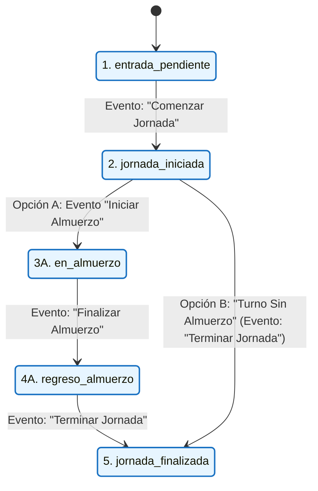
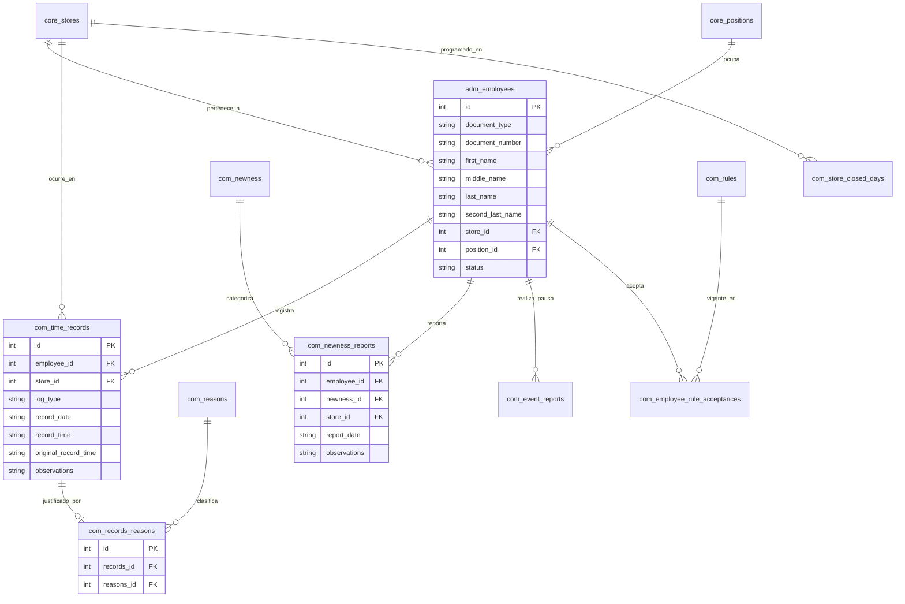

# Documentación Técnica Oficial del Módulo de Horarios y Registro de Asistencia – AppKancan

---

## 1. Introducción, Alcance y Limitaciones

### 1.1 Introducción

El Módulo de Horarios de la aplicación **AppKancan** es la solución tecnológica centralizada para el control operacional, seguimiento de asistencia, gestión de novedades y auditoría de jornadas laborales del personal de la empresa en sus distintas tiendas y puntos de venta. El sistema permite registrar de forma precisa y sincronizada los eventos diarios de los trabajadores (entrada, periodos de alimentación, pausas activas y salida), asegurando la integridad de los datos para la liquidación de horas laboradas y el monitoreo por parte de supervisores y área managers.

### 1.2 Propósito del Documento

Este documento constituye el **manual técnico oficial y definitivo** del módulo. Su objetivo es proporcionar una descripción detallada y sistemática sobre la arquitectura del software, estructura de archivos, patrones de diseño, esquema de base de datos en Directus CMS, capas de API, algoritmos de cálculo de tiempo y políticas de acceso. Está orientado a desarrolladores de software, arquitectos de sistemas, equipos de soporte técnico y administradores que requieran entender, mantener, auditar o extender la funcionalidad del módulo en el futuro.

### 1.3 Alcance del Proyecto

El módulo abarca la totalidad de la gestión operativa y administrativa del tiempo de trabajo, contemplando las siguientes áreas:

1. **Gestión de Marcaciones Diarias**:
   - Registro de inicio de jornada, inicio de almuerzo, fin de almuerzo y fin de jornada.
   - Manejo de modalidad especial de "Turno sin almuerzo", congelando los tiempos de alimentación sin descontar horas.
   - Registro y control de tiempo de pausas activas (temporizador de 5 minutos en cliente).
   - Edición manual y creación extemporánea de marcaciones con justificación obligatoria u opcional por motivo.
   - Aceptación obligatoria de normativas de asistencia al iniciar la jornada.
2. **Gestión de Novedades de Personal**:
   - Registro de incapacidades, permisos remunerados y no remunerados, vacaciones, licencias y ausencias.
   - Filtrado multicriterio, consulta visual categorizada y exportación de novedades.
3. **Historial y Auditoría de Tiempos**:
   - Consulta cronológica de asistencia por empleado, fecha y tienda.
   - Registro detallado de observaciones y cambios de hora (auditoría entre hora original y hora editada).
4. **Monitoreo y Control Estratégico (Área Manager / Admin)**:
   - Resumen mensual de indicadores de asistencia por tienda (días incompletos, días sin marcar).
   - Calendario de asistencia por tienda y gestión de días cerrados / no laborables.
   - Módulo de cierre masivo de tiendas por rango de fechas.
   - Auditoría de modificaciones manuales y rankings de cambios por tienda y empleado.
5. **Control de Planilla de Horas**:
   - Consolidación semanal y mensual de horas trabajadas en formato matricial.
   - Cálculo automático de minutos netos trabajados, descontando tiempos de alimentación correspondientes.
6. **Administración de Empleados**:
   - Creación, edición, desactivación y cambio de tienda de personal en la colección `adm_employees`.
   - Parseo automatizado de nombres completos asistido por Inteligencia Artificial y algoritmo de respaldo.
   - Perfil integral 360 del empleado con historial de marcaciones, novedades y pausas activas.
7. **Centro de Reportes y Exportación**:
   - Generación de informes en formatos Excel (.xlsx) y CSV con codificación UTF-8 BOM.
   - Soporte para consulta global seleccionando "Todas las tiendas".
8. **Capacitación e Inducción Interactiva**:
   - Tours guiados paso a paso mediante React Joyride con entorno de simulación interactiva (_fake modals_).

### 1.4 Limitaciones del Sistema y Restricciones Técnicas

Para el mantenimiento del sistema es indispensable considerar las siguientes restricciones y limitaciones operacionales:

1. **Dependencia de Conectividad a Internet**: Al basarse en una arquitectura cliente-servidor contra Directus CMS mediante peticiones HTTP REST, la marcación y consulta requieren conexión continua a la red.
2. **Identificador de Tienda por Defecto (`STORE_ID = 90`)**: En caso de que un usuario no tenga una tienda explícitamente asignada en su perfil de Directus, el sistema toma la tienda con ID 90 como valor por defecto para evitar bloqueos en la interfaz.
3. **Límite de Pausas Activas Diarias**: La lógica de negocio establece un límite estricto de máximo 2 pausas activas por empleado durante un mismo día laborable (`MAX_PAUSAS = 2`).
4. **Irreversibilidad de Omisión de Almuerzo en la UI**: La confirmación del "Turno sin almuerzo" registra marcaciones automáticas en la base de datos y deshabilita los botones en la tarjeta del empleado. Su reversión no puede realizarse desde la interfaz operativa y requiere intervención del administrador o soporte técnico directo en la base de datos.
5. **Búsqueda Parcial de Documentos en Servidor**: El campo `document_number` en la tabla `adm_employees` de Directus está definido como tipo numérico (`BigInteger`), lo que impide aplicar filtros de coincidencia parcial (`_icontains`) en peticiones al servidor. Por ello, la búsqueda por documento en el modo "Todas las tiendas" se ejecuta del lado del cliente.
6. **Pestaña Malla Horaria**: La pestaña denominada "Malla Horaria" dentro de la vista de Registros se encuentra en estado de desarrollo/placeholder en la versión actual del módulo.

### 1.5 Tecnologías Utilizadas y Requisitos del Entorno

| Capa / Componente              | Tecnología          | Versión / Detalle                                         |
| :----------------------------- | :------------------ | :-------------------------------------------------------- |
| **Lenguaje de Programación**   | TypeScript          | v5.x (Tipado estricto en interfaces)                      |
| **Librería UI**                | React               | v18.x (Componentes funcionales y Hooks)                   |
| **Empaquetador / Bundler**     | Vite                | Entorno de desarrollo y build de producción               |
| **Componentes de Interfaz**    | Material-UI (MUI)   | v5.x (Inputs, Dialogs, Tables, Autocomplete)              |
| **Estilos Auxiliares**         | Tailwind CSS        | Clases utilitarias de maquetación                         |
| **Gestión de Datos y Caché**   | TanStack Query      | v4.x (React Query para re-validación e invalidación)      |
| **Backend CMS Headless**       | Directus CMS        | API REST sobre PostgreSQL / MySQL                         |
| **Manipulación de Fechas**     | Day.js              | Configurado en zona horaria America/Bogota (UTC-5)        |
| **Validación de Formularios**  | Yup                 | Validación de esquemas de modales y formularios           |
| **Notificaciones en Pantalla** | Sileo               | Sistema de toasts con físicas y estilos personalizados    |
| **Tours Guiados**              | React Joyride       | Recorridos interactivos de inducción a usuarios           |
| **Generación de Archivos**     | XLSX / CSV Exporter | Generación de hojas de cálculo con codificación UTF-8 BOM |

---

## 2. Arquitectura General y Estructura de Directorios

### 2.1 Estructura de Directorios Detallada (`src/apps/horarios/`)

```
src/apps/horarios/
├── api/
│   └── directus/
│       ├── create.ts              # Peticiones POST, PATCH, DELETE en Directus (Time records, novedades, empleados, pausas)
│       ├── read.ts                # Peticiones GET principales (Empleados, marcaciones, novedades, razones, tiendas, cargos)
│       ├── readBulk.ts            # Consultas optimizadas en lote (Registros en rango, empleados por múltiples tiendas, días cerrados)
│       ├── reports.ts             # Consultas especializadas para pausas activas y reportes históricos
│       └── rules.ts               # Gestión de normas activas y registro de aceptación por empleado
│
├── components/                    # Componentes reutilizables y modales
│   ├── CalendarioMensualTienda.tsx # Calendario interactivo de asistencia y cierres de tienda
│   ├── EditHourModal.tsx          # Modal de corrección manual de horas con motivo obligatorio/opcional
│   ├── EmployeeCard.tsx           # Tarjeta contenedora principal de la marcación diaria de un empleado
│   ├── FestivoDay.tsx             # Indicador visual y tooltip para días festivos nacionales
│   ├── HistorialHorasModal.tsx    # Modal emergente con el historial detallado de marcaciones
│   ├── HorariosLayout.tsx         # Layout contenedor con router Outlet
│   ├── ModalCierreMasivo.tsx      # Diálogo para la gestión masiva de días cerrados por tienda
│   ├── ModalDetalleTienda.tsx     # Vista detallada de métricas y calendario de una tienda
│   ├── ModalDetalleTiendaUtils.tsx# Utilidades de cálculo para el detalle de tienda
│   ├── ModalRankingTiendas.tsx    # Ranking de tiendas con mayor número de modificaciones manuales
│   ├── NavbarHorarios.tsx         # Barra de pestañas secundarias del módulo
│   ├── NormasModal.tsx            # Modal normativo de lectura y aceptación obligatoria
│   ├── NovedadDetalleModal.tsx    # Visualización detallada de una novedad registrada
│   ├── NovedadesTab.tsx           # Pestaña de listado, búsqueda y exportación de novedades
│   ├── ObservationModal.tsx       # Modal de solo lectura para consulta de observaciones
│   │
│   ├── admin/                     # Componentes de gestión de personal
│   │   ├── DialogEditarEmpleado.tsx  # Formulario de edición de empleado
│   │   ├── DialogNuevoEmpleado.tsx   # Formulario de alta de empleado con parseo IA
│   │   └── DialogPerfilEmpleado.tsx  # Perfil 360 con KPIs y registros recientes del empleado
│   │
│   ├── cierre-masivo/             # Diálogos de cierre masivo de tiendas
│   │   └── ConfirmCierreMasivoDialog.tsx
│   │
│   ├── detalle-tienda/            # Subcomponentes del modal de detalle de tienda
│   │   ├── ConfirmClosedDayDialogs.tsx
│   │   ├── CreateHourModal.tsx
│   │   ├── EmpleadosTable.tsx
│   │   └── ModalDetalleTiendaHeader.tsx
│   │
│   ├── employee-card/             # Subcomponentes atómicos de EmployeeCard
│   │   ├── EmployeeCardHeader.tsx     # Cabecera con nombre, cargo, badge de estado y botones de acción
│   │   ├── EmployeeCardModals.tsx     # Modales emergentes (Observaciones, Novedad, Pausas, Turno Sin Almuerzo)
│   │   ├── EmployeeCardTimeSlots.tsx  # Botones de marcación de jornada (Comenzar, Iniciar/Fin Almuerzo, Salida)
│   │   └── EmployeeCardUtils.tsx      # Utilidades, temporizador de pausas activas y esquemas Yup
│   │
│   ├── historial/                 # Vista cronológica de historial
│   │   └── HistorialTimelineView.tsx
│   │
│   ├── reportes/                  # Diálogos y vistas de exportación e informes
│   │   ├── AreaManagerStoreTable.tsx
│   │   ├── DateRangeFilter.tsx
│   │   ├── ExportEventosDialog.tsx
│   │   ├── ExportHistorialDialog.tsx
│   │   ├── ExportNovedadesDialog.tsx
│   │   ├── ExportSemanalDialog.tsx
│   │   ├── ExportUnificadoDialog.tsx
│   │   ├── FestivosDetalleModal.tsx
│   │   └── ReporteSemanalAreaManager.tsx
│   │
│   └── tour/                      # Componentes para tours guiados y simulaciones
│       ├── AdminTour.tsx
│       ├── FakeExportDialog.tsx
│       ├── FakeExportModal.tsx
│       ├── FakeHistorialModal.tsx
│       ├── GenericTourModal.tsx
│       ├── HorariosTour.tsx
│       ├── HorariosTourContext.tsx
│       ├── MonitoreoTour.tsx
│       ├── TourTooltip.tsx
│       ├── TutorialButton.tsx
│       ├── fakeExportModals.tsx
│       ├── fakeTourModals.tsx
│       ├── monitoreoTourSteps.tsx
│       └── tourSteps.tsx
│
├── hooks/                         # Hooks de lógica de negocio y permisos
│   ├── useAdminEmpleados.ts       # Operaciones CRUD y búsqueda de empleados
│   ├── useHistorial.ts            # Agrupación de historial por empleado/fecha
│   ├── useHorarios.ts             # Hook principal: orquesta marcaciones, estados y novedades
│   ├── useHorariosPolicies.ts     # Evaluador de políticas de seguridad y roles Directus
│   ├── useNormas.ts               # Hook de estado de normativas de asistencia
│   └── useParseNombreIA.ts        # Parseador de nombres completos asistido por IA / Fallback
│
├── interfaces/
│   └── horarios.interface.ts      # Contratos y tipos TypeScript del módulo
│
├── pages/                         # Vistas/Páginas principales
│   ├── AdminEmpleadosPage.tsx     # Panel de administración de personal
│   ├── DetallePlanillaPage.tsx    # Planilla matricial de edición diaria
│   ├── HistorialPage.tsx          # Vista general del historial de asistencia
│   ├── MonitoreoPage.tsx          # Panel estratégico de control, cierres y auditoría
│   ├── RegistrosPage.tsx          # Página principal con cuadrícula de empleados
│   ├── ReportePage.tsx            # Centro de informes y exportaciones masivas
│   ├── monitoreo/
│   │   ├── MonitoreoComponents.tsx
│   │   ├── MonitoreoUtils.ts
│   │   └── useTiendasResumen.ts   # Hook para cálculo de resumen mensual por tiendas
│   ├── planilla/
│   │   ├── DetallePlanillaTabla.tsx
│   │   └── DetallePlanillaUtils.ts
│   └── reporte/
│       ├── ReportePausasTab.tsx
│       ├── ReporteSemanalTab.tsx
│       ├── ReporteSemanalTabla.tsx
│       ├── ReporteTourConfig.tsx
│       └── ReporteUtils.ts
│
├── utils/                         # Generación de reportes y utilidades de tiempo
│   ├── exportarEventos.ts         # Generador de CSV/Excel de Pausas Activas
│   ├── exportarHistorial.ts       # Generador de CSV/Excel de Historial
│   ├── exportarNovedades.ts       # Generador de CSV/Excel de Novedades
│   ├── exportarSemanal.ts         # Generador de CSV/Excel de Horas Semanales
│   ├── format.ts                  # Formateadores de hora 12h/24h y nombres
│   ├── novedadVisual.tsx          # Colores e iconos de tipos de novedad
│   └── timeSync.ts                # Sincronización con hora oficial de Colombia (GMT-5)
│
└── routes.tsx                     # Rutas del módulo (`/horarios/*`)
```

---

### 2.2 Enrutamiento y Navegación Secundaria (`routes.tsx` vs `NavbarHorarios`)

> 🆕 **[NUEVO - ADICIÓN TÉCNICA]**

El enrutamiento del módulo sigue un esquema híbrido optimizado para aplicaciones de una sola página (SPA):

1. **Ruta Raíz (`routes.tsx`)**: Define únicamente la ruta base `/horarios/registros` asociada al componente `HorariosLayout` y redirige cualquier sub-ruta no encontrada a esta pestaña por defecto.
2. **Navegación Secundaria en Pantalla (`NavbarHorarios.tsx`)**: La alternancia entre las 7 pestañas funcionales (**Registros**, **Novedades**, **Historial**, **Monitoreo**, **Planilla**, **Admin**, **Reportes**) se gestiona por estado reactivo interno dentro del `HorariosLayout`. Esto evita recargas innecesarias del árbol de React Query y preserva la caché activa entre cambios de vista.

---

## 3. Autenticación, Roles y Políticas de Acceso (`useHorariosPolicies`)

La seguridad y control de acceso del módulo están centralizados en el hook `useHorariosPolicies`, el cual evalúa el arreglo de cadenas `user.policies` retornado por el servicio de autenticación de Directus.

### 3.1 Evaluador de Políticas

El hook expone métodos booleanos para controlar dinámicamente la visibilidad de pestañas, botones de edición y diálogos:

```typescript
const MODULO_REGEX = /(time_?log|horario)/;

// Evalúa si el usuario es Administrador del módulo
const esAdmin = (): boolean =>
  (user?.policies ?? []).some((p) => {
    const s = p.toLowerCase();
    return s.includes("admin") && MODULO_REGEX.test(s);
  });

// Evalúa si el usuario es Área Manager / Jefe de Zona
const esAreaManager = (): boolean =>
  (user?.policies ?? []).some((p) => {
    const s = p.toLowerCase();
    const hasTimeLog =
      s.includes("time_log") || s.includes("time-log") || s.includes("timelog");
    const hasManagerOrArea = s.includes("manager") || s.includes("area");
    return hasTimeLog && hasManagerOrArea;
  });

// Evalúa si el usuario tiene permisos de consulta de reportes
const esReport = (): boolean =>
  (user?.policies ?? []).some((p) => {
    const s = p.toLowerCase();
    return s.includes("report") || esAreaManager();
  });
```

### 3.2 Matriz de Capacidades por Rol

| Funcionalidad / Pestaña                              | Usuario Tienda (Operativo) |  Área Manager (Jefe de Zona)  | Administrador (Admin System)  | Rol Reportes (`esReport`) |
| :--------------------------------------------------- | :------------------------: | :---------------------------: | :---------------------------: | :-----------------------: |
| **Registrar Marcaciones (Comenzar/Almuerzo/Salida)** |   Permitido (Su tienda)    | Permitido (Tiendas asignadas) | Permitido (Todas las tiendas) |       No Permitido        |
| **Registrar Turno Sin Almuerzo**                     |         Permitido          |           Permitido           |           Permitido           |       No Permitido        |
| **Registrar Pausa Activa**                           |         Permitido          |           Permitido           |           Permitido           |       No Permitido        |
| **Registrar Novedad (Tarjeta / Tab)**                |         Permitido          |           Permitido           |           Permitido           |       No Permitido        |
| **Edición Manual de Horas (`EditHourModal`)**        |        No Permitido        |  Permitido (Motivo opcional)  |  Permitido (Sin restricción)  |       No Permitido        |
| **Creación Manual de Horas (`CreateHourModal`)**     |        No Permitido        |           Permitido           |           Permitido           |       No Permitido        |
| **Visualizar Pestaña Monitoreo**                     |        No Permitido        |           Permitido           |           Permitido           |       No Permitido        |
| **Gestión de Días Cerrados / Cierre Masivo**         |        No Permitido        |           Permitido           |           Permitido           |       No Permitido        |
| **Visualizar Auditoría de Modificaciones**           |        No Permitido        |           Permitido           |           Permitido           |       No Permitido        |
| **Pestaña Admin Empleados (CRUD)**                   |        No Permitido        |         No Permitido          |           Permitido           |       No Permitido        |
| **Exportar Reportes (Excel / CSV)**                  |        No Permitido        |           Permitido           |           Permitido           |         Permitido         |

---

## 4. Flujo de Datos, Estado Global y Servidor (`useHorarios`)

### 4.1 Estrategia de Caché con TanStack Query

El hook `useHorarios` administra la obtención de datos remotos y la reactividad de la interfaz mediante `useQuery` y `useMutation`.

#### Estrategia de Claves de Consulta (`queryKey`):

- `['horariosStoreId']`: Identificador de la tienda asociada al usuario autenticado (`staleTime`: 30 min).
- `['empleados', STORE_ID]`: Listado de empleados pertenecientes a la tienda activa (`staleTime`: 5 min).
- `['tiposNovedad']`: Catálogo global de novedades (`com_newness`, `staleTime`: 10 min).
- `['reasons']`: Catálogo de motivos de edición (`com_reasons`, `staleTime`: 10 min).
- `['novedades', STORE_ID]`: Novedades registradas para la tienda en la fecha actual.
- `['timeRecords', STORE_ID, hoy]`: Marcaciones del día para la tienda.
- `['eventReportsToday', STORE_ID, hoy]`: Pausas activas y eventos reportados hoy en la tienda.

### 4.2 Sincronización Horaria Servidor / Cliente (`timeSync.ts`)

Para prevenir manipulaciones en el reloj local del dispositivo del cliente (ejemplo: alterar la hora de la computadora para simular una entrada a tiempo), el sistema utiliza la utilidad `getRealColombiaTime()` definida en `utils/timeSync.ts`.

Esta función normaliza las fechas y horas a la zona horaria **America/Bogota (UTC-5)** y sincroniza el tiempo contra la hora del servidor devuelta en los encabezados HTTP de las peticiones a Directus.

### 4.3 Máquina de Estados de Asistencia del Empleado

La propiedad `estadoActual` de cada objeto `EmpleadoAsistencia` se evalúa reactivamente en orden jerárquico según las marcaciones existentes en el día:



### 4.4 Mapeo de Registros de Tiempo a la Interfaz

```typescript
export interface RegistrosAsistencia {
  inicioJornada: string | null; // "HH:mm"
  inicioAlmuerzo: string | null; // "HH:mm"
  finAlmuerzo: string | null; // "HH:mm"
  finJornada: string | null; // "HH:mm"
  observaciones: Record<string, string>;
  ids?: Record<string, number>;
  horasOriginales?: Record<string, string | null>;
  horasEditadas?: Record<string, string | null>;
}
```

---

### 4.5 Persistencia y Versionamiento Dinámico de Normativas (`useNormas`)

> 🆕 **[NUEVO - ADICIÓN TÉCNICA]**

El cumplimiento y lectura obligatoria del reglamento de asistencia se gestiona mediante el hook `useNormas` y la colección Directus `com_rules`:

- **Identificador Dinámico en Storage**: La aceptación local del usuario se persiste en `localStorage` bajo la clave versionada:
  ```typescript
  const storageKey = userId && version != null ? `kancan_rules_accepted_${userId}_v${version}` : null;
  ```
- **Reactividad ante Actualizaciones de la Norma**: Si el administrador actualiza el reglamento incrementando el campo `version` en `com_rules`, la clave `storageKey` cambia automáticamente, lo que fuerza a que el indicador `debeAceptar` vuelva a evaluarse como `true` y despliegue el modal `NormasModal` en la primera marcación del día hasta su nueva aceptación.

---

## 5. Análisis Exhaustivo de Funcionalidades y Pestañas

### 5.1 Pestaña Registros (`RegistrosPage` & `EmployeeCard`)

#### 5.1.1 Cuadrícula de Tarjetas de Empleados

Muestra una grilla responsiva de tarjetas (`EmployeeCard`), filtradas por la tienda seleccionada. Para usuarios administradores y managers, la vista ofrece un selector `Autocomplete` en la cabecera para alternar entre tiendas.

#### 5.1.2 Componentes de `EmployeeCard`

Cada tarjeta está desglosada en componentes modulares:

1. **`EmployeeCardHeader`**: Muestra nombre, documento, cargo, badge de estado actual (`entrada_pendiente`, `jornada_iniciada`, `en_almuerzo`, `regreso_almuerzo`, `jornada_finalizada`), botón de pausa activa (con indicador de pausas restantes) y botón para registrar novedad.
2. **`EmployeeCardTimeSlots`**: Renderiza los cuatro botones correspondientes a los eventos de la jornada. Cada fila incluye:
   - Botón de edición rápida de hora (icono de reloj `AccessTimeIcon`, visible para administradores).
   - Botón principal de marcación (muestra la hora registrada o el estado activo).
   - Botón de observación (icono de libreta `AssignmentIcon`).
3. **`EmployeeCardModals`**: Contiene los modales de observación, novedad, reporte de eventos y confirmación de turno sin almuerzo.

---

#### 5.1.3 Funcionalidad Especial: Turno Sin Almuerzo

En ciertos esquemas operativos, la jornada laboral del empleado no contempla tiempo de almuerzo. Para gestionar este escenario de forma transparente y consistente sin alterar el flujo de marcaciones del backend, se diseñó la solución del **Turno Sin Almuerzo**:

- **Activación en la UI**: En la fila correspondiente a **Iniciar Almuerzo**, mientras la marcación esté pendiente y el estado sea `jornada_iniciada`, el botón secundario de observación se sustituye por un botón con icono ámbar (`NoFoodIcon`) titulado **"Turno sin almuerzo"**.
- **Modal de Confirmación**: Al hacer clic en este botón, se despliega el diálogo `EmployeeCardOmitirAlmuerzoModal`, el cual advierte explícitamente al usuario:

  > "Al confirmar, las casillas de almuerzo quedarán deshabilitadas, este tiempo no se descontará del total de horas trabajadas del día y la acción solo podrá revertirse a través del equipo de soporte/sistemas."

- **Lógica de Ejecución Backend (`handleConfirmarSinAlmuerzo`)**:
  Al confirmar la acción, la tarjeta ejecuta la siguiente rutina asíncrona:

```typescript
const handleConfirmarSinAlmuerzo = async () => {
  setOmitiendoAlmuerzo(true);
  try {
    // 1. Registra el inicio de almuerzo con la hora del servidor
    await onRegistrarEvento(id, "Iniciar Almuerzo");
    // 2. Registra de inmediato la finalización de almuerzo con la misma hora
    await onRegistrarEvento(id, "Finalizar Almuerzo");
    // 3. Activa la bandera local de bloqueo
    setAlmuerzoOmitidoLocal(true);
    setOmitirAlmuerzoModalOpen(false);
  } finally {
    setOmitiendoAlmuerzo(false);
  }
};
```

- **Efecto en la Base de Datos y Cálculos**:
  - Ambas marcaciones (`Iniciar Almuerzo` y `Finalizar Almuerzo`) quedan registradas en la colección `com_time_records` con timestamps idénticos.
  - La duración del almuerzo calculada por la función `calcularMinutosDia` es exactamente **0 minutos**.
  - El total de horas laboradas de la jornada no sufre ningún descuento por concepto de almuerzo.
  - Las casillas de almuerzo quedan congeladas en la interfaz de la tarjeta con el estado **"No Aplica"**.
- **Soporte en el Tour Guiado**: El paso de marcaciones del tutorial interactivo (`tourSteps.tsx`) explica detalladamente la función del icono `NoFoodIcon` para la omisión de almuerzo.

---

#### 5.1.4 Pausas Activas

- Cada empleado dispone de un máximo de 2 pausas activas por día (`MAX_PAUSAS = 2`).
- Al iniciar una pausa activa mediante `EmployeeCardEventoModal`, se dispara un temporizador en el frontend (`useActiveBreak`) con un contador regresivo visual de **5 minutos**.
- La pausa activa se registra como un evento en la colección `com_event_reports` con el tipo `'Iniciar Pausa Activa'` y `'Terminar Pausa Activa'`.

#### 5.1.5 Edición y Creación Manual de Horas (`EditHourModal` & `CreateHourModal`)

- **Edición**: Permite modificar la hora de un evento ya registrado mediante `EditHourModal`. Exige la selección de un motivo predefinido desde la colección `com_reasons` y una observación justificativa.
- **Creación Extemporánea de Marcaciones (`CreateHourModal`)**: 
  > 🆕 **[NUEVO - ADICIÓN TÉCNICA]**
  Permite a administradores y jefes de zona registrar manualmente un evento de marcación (ejemplo: inicio de jornada o salida) que el empleado no pudo realizar en su momento por fallas de conexión o fuerza mayor. A diferencia de `EditHourModal` (que modifica un registro existente), `CreateHourModal` inserta un nuevo `time_record` asociando el motivo justificado y el autor de la creación en la auditoría.
- **Auditoría de Ediciones**: La hora original se preserva intacta en el campo `original_record_time` de `com_time_records`, mientras que la nueva hora se guarda en `record_time`. La relación con el motivo se persiste en la tabla asociativa `com_records_reasons`.

---

### 5.2 Pestaña Novedades (`NovedadesTab`)

Proporciona la vista tabular de todas las novedades operacionales (incapacidades, permisos remunerados/no remunerados, vacaciones, ausencias injustificadas, etc.) registradas para la tienda.

- **Filtros Avanzados**: Permite filtrar por nombre de empleado, rango de fechas (Desde/Hasta) y estado del empleado ("Solo activos").
- **Mapeo Visual (`novedadVisual.tsx`)**: Asigna iconos específicos y chips de colores acordes al tipo de novedad para facilitar su identificación rápida.
- **Exportación**: Incluye un botón dedicado para exportar la tabla filtrada a un archivo Excel (.xlsx) utilizando la utilidad `exportarNovedades.ts`.

---

### 5.3 Pestaña Historial (`HistorialPage`)

Ofrece una vista consolidada y cronológica del historial de marcaciones de los empleados.

- **Agrupación de Datos**: Transforma el arreglo plano de marcaciones devueltos por `fetchTimeRecords` en una estructura de filas por `Empleado + Fecha` (`agruparRegistros`).
- **Cálculo de Horas**: Calcula automáticamente la duración del turno y el tiempo de almuerzo descontado.
- **Modal de Observaciones (`ObservationModal`)**: Si un evento contiene observaciones o fue editado manualmente, se despliega un indicador visual que permite abrir un modal para examinar los detalles.

---

### 5.4 Pestaña Monitoreo (`MonitoreoPage`)

Panel de control reservado exclusivamente para roles con permisos de administración o jefatura de zona (`esAdmin()` o `esAreaManager()`). Se divide en dos subpestañas:

#### 5.4.1 Subpestaña: Resumen de Asistencia

- **Tarjetas KPI**: Muestra el total de tiendas evaluadas, empleados activos, días con marcación incompleta y días sin marcar en el mes.
- **Detalle de Tienda (`ModalDetalleTienda`)**: Abre un modal avanzado que combina la lista de empleados con un calendario interactivo (`CalendarioMensualTienda`).
- **Gestión de Días Cerrados (`com_store_closed_days`)**: Permite a los administradores seleccionar días en el calendario y marcarlos como "Día Cerrado / No Laboral". Esto evita que el sistema contabilice faltas de asistencia en festivos o cierres de tienda.
- **Cierre Masivo (`ModalCierreMasivo`)**: Diálogo que permite marcar múltiples tiendas y rangos de fechas como días cerrados en una sola operación.

#### 5.4.2 Subpestaña: Auditoría de Ediciones Manuales

- Muestra el historial completo de modificaciones manuales de hora realizadas por administradores o managers.
- Muestra tarjetas de estadísticas con el total de ediciones, empleados monitoreados, la tienda con más cambios y el empleado con más ajustes.
- **Rankings Operativos**: Integra `ModalRankingTiendas` y `ModalRankingEmpleados` para detectar patrones atípicos de edición manual de tiempos.

---

### 5.5 Pestaña Control de Horas / Planilla (`DetallePlanillaPage`)

Permite la visualización y edición rápida en formato de tabla matricial (días de la semana vs empleados) para un control ágil por parte del Área Manager.

- **Reglas de Edición**:
  - `esAdmin()`: Edición directa de celdas sin requerir motivo obligatorio.
  - `esAreaManager()`: Edición con selección de motivo opcional.
  - `esReport()`: Deshabilitado para edición (solo lectura).

---

### 5.6 Pestaña Admin Empleados (`AdminEmpleadosPage`)

Panel de administración de personal para dar de alta, editar y gestionar la asignación de tiendas de los empleados.

#### 5.6.1 Filtro "Todas las Tiendas" y Paginación Rendidora

- Incluye el selector `OPCION_TODAS` (`id: -1`). Al seleccionarlo, la aplicación obtiene la totalidad de empleados de la empresa (`listarTodosEmpleados`) y realiza el filtrado de búsqueda por nombre o número de documento en el cliente.
- Aplica paginación en múltiplos de 3 (6, 12, 24, 48 elementos por página) para mantener un renderizado fluido del grid de tarjetas.

#### 5.6.2 Alta de Empleado con Parseo de Nombre asistido por IA

El modal `DialogNuevoEmpleado` permite ingresar el nombre completo en un solo campo. La utilidad `useParseNombreIA` analiza la cadena mediante IA (o un algoritmo de respaldo local `splitNombreLocal`) para separar automáticamente:

- `first_name` (Primer nombre)
- `middle_name` (Segundo nombre)
- `last_name` (Primer apellido)
- `second_last_name` (Segundo apellido)

#### 5.6.3 Toasts Animados de Sileo

La creación de empleados utiliza la librería **Sileo** (`sileo.promise`), mostrando una notificación con estados físicos:

- **Cargando**: "Creando empleado..."
- **Éxito**: "Empleado creado" con una tarjeta incrustada (`EmpleadoCreadoCard`) que resume el nombre, documento, tienda y cargo.
- **Error**: Detalle legible de la falla devuelta por Directus.

#### 5.6.4 Perfil 360 del Empleado (`DialogPerfilEmpleado`)

Al hacer clic en una tarjeta de empleado, se abre un modal de perfil que muestra:

- Información personal y laboral.
- KPIs mensuales de asistencia (Jornadas completadas, pausas activas, novedades).
- Listados recientes de marcaciones, novedades y pausas activas.

---

### 5.7 Pestaña Reportes y Exportación (`ReportePage`)

Centro unificado para la generación de reportes operativos en formato Excel/CSV.

#### 5.7.1 Filtro "Todas las Tiendas" en Reporte Page (Detalle de `documentacion_felix.md`)

El Autocomplete de selección de tiendas en `ReportePage.tsx` incorpora la opción centinela:

```typescript
const OPCION_TODAS: Tienda = { id: -1, name: "Todas las tiendas" };
const opcionesTienda = [OPCION_TODAS, ...tiendasAMostrar];
```

- **Comportamiento de Selección**: Cuando el usuario selecciona "Todas las tiendas" (o no tiene una tienda seleccionada por defecto), el manejador de eventos asigna `null` como identificador de tienda (`storeSel = null`).
- **Peticiones a Backend**: Al recibir `null`, los hooks de consulta (`useQuery`) omiten el filtro `store_id` en las peticiones a Directus, recuperando los datos consolidados de la totalidad de las tiendas.
- **Comparación Estricta**: Se utiliza la propiedad `isOptionEqualToValue={(option, value) => Number(option.id) === Number(value.id)}` para asegurar que el componente mantenga la opción seleccionada sin discrepancias de tipos (string vs number).

#### 5.7.2 Diálogos de Exportación Masiva

- **`ExportUnificadoDialog`**: Diálogo principal que permite descargar en un solo archivo o en pestañas separadas los reportes de Registros, Novedades, Pausas Activas y Consolidado Semanal.
- **`ExportSemanalDialog`**: Genera el reporte consolidado de horas laboradas por semana, calculando horas ordinarias y extras.
- **Formatos de Salida**: Los archivos CSV generados incorporan la marca BOM UTF-8 (`\uFEFF`), delimitador por punto y coma (`;`) y nombramiento dinámico con timestamp (`nombre_YYYYMMDD_HHmmss.csv`) para evitar sobrescrituras.

#### 5.7.3 Pestaña Consolidado Semanal en Pantalla (`ReporteSemanalTab` & `ReporteSemanalTabla`)

> 🆕 **[NUEVO - ADICIÓN TÉCNICA]**

Además de las descargas en Excel/CSV, el centro de reportes ofrece la consulta interactiva en tiempo real:

- **Matriz de Horas por Empleado**: Muestra en pantalla el desglose diario de horas laboradas durante la semana seleccionada.
- **Badge de Registros Incompletos**: Identifica mediante un contador rojo los días donde el empleado registró entrada pero omitió la salida (o viceversa).
- **Indicador de Festivos (`FestivosChip`)**: Muestra la proporción de días festivos nacionales laborados por el empleado en el periodo (ejemplo `1/2 festivos`) con acceso directo al modal de auditoría de festivos.

#### 5.7.4 Pestaña Auditoría de Pausas Activas en Pantalla (`ReportePausasTab`)

> 🆕 **[NUEVO - ADICIÓN TÉCNICA]**

Proporciona la vista tabular de todos los reportes de pausas activas registrados (`com_event_reports`), con desglose por fecha, hora de inicio/fin, duración efectiva de 5 minutos y observaciones registradas por el personal.

#### 5.7.5 Utilidades de Reportes (`ReporteUtils.ts`)

> 🆕 **[NUEVO - ADICIÓN TÉCNICA]**

- `getAvatarColor(texto)`: Generador determinista de color basado en hash para asignar avatares únicos e identifiables por empleado.
- `calcularMinutosSemanales(empId, startStr, endStr, records)`: Consolida en memoria los minutos trabajados descontando almuerzo para el rango semanal seleccionado.

---

### 5.8 Sistema de Tours Guiados (`components/tour/`)

Para la capacitación interactiva de los usuarios, el módulo integra la librería `react-joyride`.

- **Módulos de Tour**: `HorariosTour` (Pestaña Registros), `MonitoreoTour` (Pestaña Monitoreo), `AdminTour` (Administración de Empleados) y `ReporteTourConfig`.
- **Modales Simulados ("Fake Modals")**: 
  > 🆕 **[NUEVO - ADICIÓN TÉCNICA]**
  Para evitar que el usuario altere datos reales durante un tutorial, el sistema integra el contexto `HorariosTourContext.tsx` que renderiza componentes simulados (`fakeTourModals.tsx`, `FakeExportModal.tsx`, `FakeHistorialModal.tsx`). Estos modales imitan la interfaz real y simulan la ejecución de peticiones HTTP en memoria, permitiendo una experiencia de capacitación 100% inmersiva sin afectar la base de datos de Directus.

---

### 5.9 Gestión e Integración de Festivos Nacionales (Colombia / Ley Emiliani)

> 🆕 **[NUEVO - ADICIÓN TÉCNICA]**

El sistema integra un módulo especializado para la gestión y detección de días festivos nacionales en Colombia:

- **Decorador Visual de Pickers (`FestivoDay.tsx`)**: Sobrescribe el componente `PickersDay` de Material-UI para destacar visualmente en los calendarios los días festivos nacionales con fondo rojizo y punto indicador, incluyendo un tooltip con el nombre oficial de la festividad devuelto por el mapa `holidayMap`.
- **Detalle de Festivos Trabajados (`FestivosDetalleModal.tsx`)**: Despliega un diálogo emergente con el desglose de cada festivo laborado por el empleado en el mes, detallando la fecha, nombre de la festividad, minutos netos trabajados y un enlace rápido a la visualización de las marcas originales.

---

## 6. Base de Datos y Modelo de Datos (Directus CMS)

### 6.1 Colecciones Directus y Mapeo Físico vs Conceptual

| Nombre Físico en Directus       | Nombre Conceptual | Descripción / Uso                                                                                                                                       |
| :------------------------------ | :---------------- | :------------------------------------------------------------------------------------------------------------------------------------------------------ |
| `adm_employees`                 | Employees         | Almacena los datos personales y laborales del personal (`first_name`, `last_name`, `document_number`, `store_id`, `position_id`, `status`).             |
| `core_stores`                   | Stores            | Catálogo de tiendas de la empresa (`id`, `name`, `ultra_code`, `company`).                                                                              |
| `core_positions`                | Positions         | Catálogo de cargos/puestos de trabajo (`id`, `name`).                                                                                                   |
| `com_time_records`              | Time Records      | Contiene cada evento de marcación diaria (`employee_id`, `store_id`, `log_type`, `record_date`, `record_time`, `original_record_time`, `observations`). |
| `com_newness`                   | Newness Catalog   | Catálogo de tipos de novedad (`id`, `name`).                                                                                                            |
| `com_newness_reports`           | Newness Reports   | Novedades registradas para empleados (`employee_id`, `newness_id`, `report_date`, `observations`, `store_id`).                                          |
| `com_reasons`                   | Edit Reasons      | Catálogo de motivos justificados para edición de hora (`id`, `name`, `status`).                                                                         |
| `com_records_reasons`           | Record Reasons    | Tabla asociativa que vincula un registro editado con su motivo (`records_id` → `com_time_records.id`, `reasons_id` → `com_reasons.id`).                 |
| `com_event_reports`             | Event Reports     | Registro de pausas activas y eventos especiales (`employee_id`, `store_id`, `event_type`, `observations`, `date`, `hour`).                              |
| `com_store_closed_days`         | Store Closed Days | Registro de días no laborables o cerrados por tienda (`store_id`, `date`, `status`).                                                                    |
| `com_rules`                     | Rules             | Normativas y reglamentos vigentes de registro de tiempo (`id`, `version`, `title`, `content`).                                                          |
| `com_employee_rule_acceptances` | Rule Acceptances  | Registro de aceptación de normativas por empleado (`employee_id`, `rule_id`, `version`, `accepted_at`).                                                 |

---

### 6.2 Diagrama de Entidad-Relación (Mermaid)



---

## 7. Capa de Servicios de API REST (`api/directus/`)

### 7.1 Módulo `read.ts` & `readBulk.ts` (Lecturas)

- **`getStoreIdUsuarioActual()`**: Consulta la información del usuario autenticado vía `readMe` para obtener su `store_id` predeterminado.
- **`getEmpleados(storeId)`**: Retorna los empleados de la tienda especificada utilizando `getEmpleadosBulk`.
- **`getTiposNovedad()`**: Lee la colección `com_newness`.
- **`getReasons()`**: Lee los motivos activos de `com_reasons` ordenados alfabéticamente (ubicando "Otro" al final).
- **`getReasonNamesForRecords(recordIds[])`**: Realiza una consulta bulk sobre `com_records_reasons` para construir un mapa `recordId -> reasonName`.
- **`getNovedades(storeId)` / `getStoreNovedades(storeId)`**: Obtiene las novedades registradas de una o varias tiendas expandiendo las relaciones `employee_id`, `newness_id` y `store_id`.
- **`fetchTimeRecords(inicio, fin, storeId, employeeId)`**: Lee las marcaciones de `com_time_records` filtrando por fechas, tiendas o empleado.
- **`getEditedTimeRecords(storeIds, inicio, fin)`**: Consulta para la pestaña de Monitoreo que recupera exclusivamente los registros que poseen `original_record_time` no nulo o registros asociados en `com_records_reasons`.
- **`getTimeRecordsBulkRange(storeIds, inicio, fin)`**: Método optimizado para cargar en una sola petición HTTP los registros de múltiples tiendas en un rango de fechas.

### 7.2 Módulo `create.ts` (Escritura y Modificación)

- **`createTimeRecord(data)`**: Inserta un nuevo registro de tiempo en `com_time_records`.
- **`updateTimeRecord(id, data)`**: Actualiza la hora (`record_time`), hora original (`original_record_time`) u observaciones de un registro.
- **`upsertRecordReason(recordId, reasonId)`**: Inserta o actualiza la vinculación entre una marcación editada y su motivo en `com_records_reasons`.
- **`createNovedad(data)` / `createNovedades(items[])`**: Inserta una o varias novedades en lote en `com_newness_reports`.
- **`createEventReport(data)`**: Inserta un reporte de pausa activa en `com_event_reports`.
- **`setStoreClosedDayStatus(storeId, date, status)`**: Crea, actualiza o desactiva un registro de día cerrado en `com_store_closed_days`.
- **`crearEmpleado(data)` / `actualizarEmpleado(id, data)`**: Gestión de personal en `adm_employees`.

---

## 8. Algoritmos y Lógica de Negocio Relevante

### 8.1 Algoritmo de Cálculo de Minutos Trabajados en el Día (`calcularMinutosDia`)

Ubicado en `utils/exportarSemanal.ts` y reutilizado en toda la aplicación, este algoritmo determina las horas netas trabajadas por un empleado en una fecha dada:

```typescript
export function calcularMinutosDia(
  inicioJornada: string | null,
  inicioAlmuerzo: string | null,
  finAlmuerzo: string | null,
  finJornada: string | null,
): number {
  if (!inicioJornada || !finJornada) return 0;

  const tInicio = dayjs(`2000-01-01 ${inicioJornada}`);
  const tFin = dayjs(`2000-01-01 ${finJornada}`);

  if (!tInicio.isValid() || !tFin.isValid()) return 0;

  // Minutos brutos entre entrada y salida
  let minutosTotales = tFin.diff(tInicio, "minute");
  if (minutosTotales < 0) minutosTotales += 24 * 60; // Manejo de turnos nocturnos

  // Descuento de almuerzo si ambas marcaciones existen
  if (inicioAlmuerzo && finAlmuerzo) {
    const tInicioAlm = dayjs(`2000-01-01 ${inicioAlmuerzo}`);
    const tFinAlm = dayjs(`2000-01-01 ${finAlmuerzo}`);
    if (tInicioAlm.isValid() && tFinAlm.isValid()) {
      let minutosAlmuerzo = tFinAlm.diff(tInicioAlm, "minute");
      if (minutosAlmuerzo < 0) minutosAlmuerzo += 24 * 60;
      minutosTotales -= minutosAlmuerzo;
    }
  }

  return Math.max(0, minutosTotales);
}
```

> **Nota respecto al Turno Sin Almuerzo**: Dado que en el Turno Sin Almuerzo `inicioAlmuerzo` y `finAlmuerzo` son idénticos, `minutosAlmuerzo` resulta en `0`, por lo que `minutosTotales` conserva el 100% de la jornada sin descuento.

---

### 8.2 Algoritmo de Consolidación Semanal del Mes (`getSemanasDelMes`)

Para la generación del reporte semanal, el sistema calcula los bloques de semanas que componen un mes determinado, respetando el día de inicio de semana configurado por el usuario (ejemplo: Lunes = 1, Domingo = 0):

```typescript
export function getSemanasDelMes(
  year: number,
  month: number,
  diaInicioSemana: number = 1,
  diaFinSemana: number = 0,
): { numeroSemana: number; start: string; end: string; label: string }[] {
  const semanas = [];
  const primerDiaMes = dayjs().year(year).month(month).date(1);
  const ultimoDiaMes = primerDiaMes.endOf("month");

  let current = primerDiaMes;
  let numeroSemana = 1;

  while (
    current.isBefore(ultimoDiaMes) ||
    current.isSame(ultimoDiaMes, "day")
  ) {
    let inicioSemana = current;
    let finSemana = current.day(diaFinSemana);

    if (finSemana.isBefore(inicioSemana)) {
      finSemana = finSemana.add(7, "day");
    }

    semanas.push({
      numeroSemana,
      start: inicioSemana.format("YYYY-MM-DD"),
      end: finSemana.format("YYYY-MM-DD"),
      label: `Semana ${numeroSemana} (${inicioSemana.format("DD/MM")} - ${finSemana.format("DD/MM")})`,
    });

    current = finSemana.add(1, "day");
    numeroSemana++;
  }

  return semanas;
}
```

---

### 8.3 Algoritmo de Cálculo de Festivos Trabajados (`obtenerFestivosTrabajadosEmp`)

> 🆕 **[NUEVO - ADICIÓN TÉCNICA]**

Ubicado en `components/reportes/FestivosDetalleModal.tsx`, este algoritmo analiza las marcaciones del empleado en el mes y las cruza contra el mapa de festivos nacionales (`holidayMap`):

```typescript
export const obtenerFestivosTrabajadosEmp = (
  empId: unknown,
  records: any[],
  holidayMap: Record<string, string>,
  anio: number,
  mes: number
) => {
  const diasTrabajados = new Set<string>();
  records.forEach(r => {
    const id = Number(r.employee_id?.id || r.employee_id);
    if (id !== Number(empId)) return;
    const fechaStr = r.record_date;
    if (!fechaStr) return;
    const d = dayjs(fechaStr);
    if (d.year() === anio && d.month() === mes && holidayMap[fechaStr]) {
      diasTrabajados.add(fechaStr);
    }
  });

  return Array.from(diasTrabajados).map(fechaStr => {
    const recsDelDia = records.filter(r => 
      Number(r.employee_id?.id || r.employee_id) === Number(empId) && 
      r.record_date === fechaStr
    );
    let totalDia = 0;
    const entrada = recsDelDia.find(r => r.log_type === 'Comenzar Jornada');
    const salida = recsDelDia.find(r => r.log_type === 'Terminar Jornada');
    if (entrada && salida) {
      // Cálculo de minutos brutos y descuento de almuerzo si aplica
      // ...
    }
    return {
      fecha: fechaStr,
      nombre: holidayMap[fechaStr],
      minutos: totalDia > 0 ? totalDia : 0,
      records: recsDelDia
    };
  }).sort((a, b) => a.fecha.localeCompare(b.fecha));
};
```

---

### 8.4 Algoritmo de Clasificación de KPIs de Monitoreo (`useTiendasResumen`)

> 🆕 **[NUEVO - ADICIÓN TÉCNICA]**

Ubicado en `pages/monitoreo/useTiendasResumen.ts`, este algoritmo evalúa día por día la salud operacional de cada tienda en un rango de fechas:

1. **Exclusión de Fechas no Evaluables**: Se ignoran la fecha actual (`esHoy`), fechas futuras (`esFuturo`) y fechas marcadas en `com_store_closed_days` (`fechasCerradas`).
2. **Evaluación de Marcaciones Diarias**:
   - `sinRegistro`: Si no existe ninguna marcación registrada en el día para la tienda.
   - `incompletos`: Si para algún empleado existe marcación de entrada pero falta la salida (o viceversa).
   - `completados`: Total de empleados con jornada completa (entrada y salida registradas) en el día de hoy.

---

### 8.5 Mapeo Visual de Novedades y Formateo de Nombres (`novedadVisual.tsx` & `format.ts`)

> 🆕 **[NUEVO - ADICIÓN TÉCNICA]**

Ubicado en `utils/novedadVisual.tsx` y `utils/format.ts`, estos módulos estandarizan la presentación de datos en toda la interfaz:

- **Categorización Visual de Novedades (`getIconForTipo` / `getChipColor`)**:
  - `incapacidad`: Verde `#16a34a` / Icono `HealthAndSafety`.
  - `vacaciones`: Celeste `#0ea5e9` / Icono `BeachAccess`.
  - `calamidad`: Rojo `#dc2626` / Icono `Warning`.
  - `suspensión`: Rojo Oscuro `#991b1b` / Icono `Gavel`.
  - `ausencia`: Amarillo `#ca8a04` / Icono `Block`.
  - `permiso`: Ámbar `#f59e0b` / Icono `AssignmentTurnedIn`.
  - `familia`: Violeta `#8b5cf6` / Icono `FamilyRestroom`.
  - `capacitación`: Azul `#3b82f6` / Icono `School`.
  - `descanso`: Azul Cielo `#0284c7` / Icono `FreeBreakfast`.

- **Formateo de Nombre Completo (`formatNombreEmpleado`)**: Combina determinísticamente `first_name`, `middle_name`, `last_name` y `second_last_name` aplicando capitalización limpia en cada palabra.

---

## 9. Guía Práctica para Desarrolladores y Mantenimiento Futuro

### 9.1 Cómo Añadir un Nuevo Tipo de Evento de Jornada

1. **Actualizar la interfaz**: Modifique `RegistrosAsistencia` en `src/apps/horarios/interfaces/horarios.interface.ts` agregando la nueva clave.
2. **Actualizar el mapeador**: En `src/apps/horarios/hooks/useHorarios.ts`, modifique la función `empleadosMapeados` evaluando el nuevo `log_type` retornado por Directus.
3. **Actualizar los botones**: En `EmployeeCard.tsx` / `EmployeeCardTimeSlots.tsx`, añada la nueva fila de marcación e icono correspondiente.
4. **Ajustar el cálculo de tiempo**: Si el evento afecta el tiempo laborado, actualice `calcularMinutosDia`.

### 9.2 Cómo Añadir un Nuevo Reporte o Exportación Excel

1. Cree un módulo exportador en `src/apps/horarios/utils/exportarNuevoReporte.ts`.
2. Utilice la plantilla de construcción de CSV con delimitador `;` y prefijo UTF-8 BOM (`\uFEFF`).
3. Cree el diálogo de interfaz en `src/apps/horarios/components/reportes/ExportNuevoReporteDialog.tsx`.
4. Vincule el nuevo reporte dentro de `ExportUnificadoDialog.tsx` y en la pestaña de `ReportePage.tsx`.

### 9.3 Diagnóstico y Errores Frecuentes

- **Error de token expirado o 401 Unauthorized**:
  - _Causa_: La sesión de Directus ha vencido.
  - _Solución_: Verifique que la petición esté envuelta con el interceptor `withAutoRefresh()` importado de `@/auth/services/directusInterceptor`.

- **Registros de marcación que no se refrescan automáticamente**:
  - _Causa_: Invalidación de caché omitida tras la mutación.
  - _Solución_: Asegúrese de llamar a `queryClient.invalidateQueries({ queryKey: ['timeRecords'] })` en el callback `onSuccess` del `useMutation`.

- **Descalce en el cálculo de horas semanales**:
  - _Causa_: Discrepancia en la zona horaria del cliente.
  - _Solución_: Verifique que el análisis de fechas utilice `dayjs` con la hora sincronizada mediante `getRealColombiaTime()`.

---

_Fin de la Documentación Técnica Oficial del Módulo de Horarios de AppKancan._
