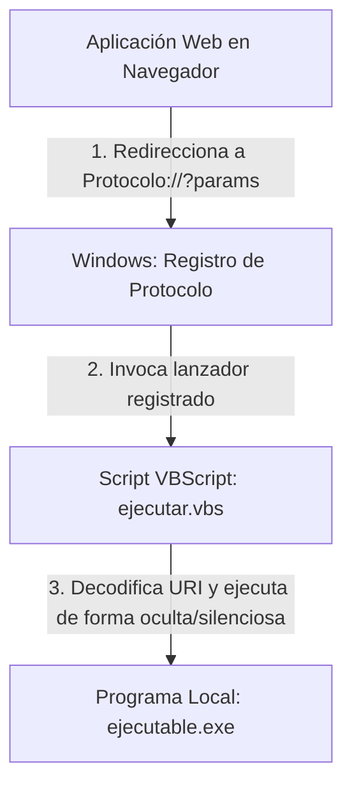

# Guía: Integración de Aplicaciones Web con Ejecutables Locales mediante Protocolos URI

Esta guía detalla el método estándar para integrar una aplicación web con programas ejecutables locales (`.exe`) en Windows utilizando **Protocolos URI Personalizados** (por ejemplo, `ContabilizarFactura://` o `ResolucionesUltra://`).

---

## 1. Arquitectura de Integración

Para lograr que una aplicación en el navegador web pueda comunicarse y ejecutar código nativo en la máquina del usuario final, se utiliza la siguiente arquitectura de tres capas:



### ¿Por qué se utiliza un VBScript en el medio?
Si el navegador llamara directamente al `.exe`, Windows abriría una ventana negra de consola (`cmd.exe`) molesta para el usuario, o fallaría si el formato del argumento que pasa el navegador no coincide estrictamente con lo que espera el ejecutable.
El script VBScript actúa como un puente ("wrapper") que:
1. **Oculta la consola** ejecutando el programa de forma silenciosa.
2. **Parsea y decodifica la URL** (remplazando caracteres codificados como `%20` por espacios, `%3A` por `:`, etc.).
3. **Genera registros de depuración** (`log_vbs.txt`) en caso de que ocurran errores.

---

## 2. Paso 1: Registro del Protocolo en Windows

Para que Windows reconozca una URI personalizada, esta debe estar inscrita en el Registro de Windows bajo `HKEY_CURRENT_USER\Software\Classes` (para instalación por usuario, lo cual no requiere privilegios de administrador).

Las claves a crear son:
* `HKCU\Software\Classes\<NombreProtocolo>`
  * Valor por defecto (REG_SZ): `"URL:<Descripción del protocolo>"`
  * Valor `"URL Protocol"` (REG_SZ): `""` (vacío)
* `HKCU\Software\Classes\<NombreProtocolo>\shell\open\command`
  * Valor por defecto (REG_SZ): `"wscript.exe \"C:\Ruta\Al\Script\ejecutar.vbs\" \"%1\""`

*(Donde `%1` representa la URL completa enviada por el navegador).*

---

## 3. Paso 2: El VBScript Lanzador (`ejecutar.vbs`)

Este script recibe la URL enviada por Windows, extrae los parámetros que vienen después del signo `?`, reemplaza los caracteres web codificados y lanza el ejecutable.

### Código Plantilla (`ejecutar.vbs`)
```vbscript
Option Explicit

Dim objShell, objFSO, objLog
Dim rutaRoaming, carpetaTrabajo, nombreExe, rutaExe, rutaLog
Dim argumentos, comandoCompleto, codigoRetorno

Set objShell = CreateObject("WScript.Shell")
Set objFSO = CreateObject("Scripting.FileSystemObject")

' 1. Configuración de Rutas
rutaRoaming = objShell.ExpandEnvironmentStrings("%APPDATA%")
carpetaTrabajo = rutaRoaming & "\IntegracionUltra\MiModuloUltra"
nombreExe = "MiProgramaLocal.exe"
rutaExe = carpetaTrabajo & "\" & nombreExe
rutaLog = carpetaTrabajo & "\log_vbs.txt"

' 2. Crear Log para Depuración
Set objLog = objFSO.CreateTextFile(rutaLog, True)
objLog.WriteLine "Iniciando VBS - " & Now

' 3. Procesar Argumentos de la URI
argumentos = ""
If WScript.Arguments.Count > 0 Then
    Dim urlCompleta
    urlCompleta = WScript.Arguments(0)
    objLog.WriteLine "URL Recibida: " & urlCompleta

    ' Extraer la parte posterior al "?"
    Dim posInterrogacion
    posInterrogacion = InStr(urlCompleta, "?")
    If posInterrogacion > 0 Then
        argumentos = Mid(urlCompleta, posInterrogacion + 1)
    Else
        argumentos = urlCompleta
    End If

    ' Decodificar caracteres web comunes
    argumentos = Replace(argumentos, "%20", " ")
    argumentos = Replace(argumentos, "%3A", ":")
    argumentos = Replace(argumentos, "%2F", "/")
    argumentos = Replace(argumentos, "%3D", "=")
End If
objLog.WriteLine "Argumentos decodificados: " & argumentos

' 4. Ejecución del Programa
If objFSO.FileExists(rutaExe) Then
    objShell.CurrentDirectory = carpetaTrabajo
    comandoCompleto = """" & rutaExe & """ " & argumentos
    objLog.WriteLine "Comando a ejecutar: " & comandoCompleto
    
    ' El número al final define el comportamiento de la ventana:
    ' 0 = Ejecutar de forma invisible/silenciosa (oculta la consola)
    ' 1 = Mostrar ventana de forma normal
    ' True = Esperar a que el ejecutable termine
    codigoRetorno = objShell.Run(comandoCompleto, 0, True)
    objLog.WriteLine "Código de retorno del EXE: " & codigoRetorno
Else
    objLog.WriteLine "ERROR: No se encontró el .exe en " & rutaExe
End If

objLog.WriteLine "Finalizado - " & Now
objLog.Close

Set objShell = Nothing
Set objFSO = Nothing
WScript.Quit
```

---

## 4. Paso 3: El Instalador por Lotes (`instalar.bat`)

Este archivo automatiza la creación de las carpetas locales en `%APPDATA%`, la copia de los archivos ejecutables y VBScript, y la inyección en el registro de Windows.

### Código Plantilla (`instalar.bat`)
```batch
@echo off
chcp 65001 >nul
echo ====================================================
echo   Instalador de Integracion de Protocolo Local
echo ====================================================

:: Variables de configuración
set "PROTOCOLO=MiProtocolo"
set "DESTINO=%APPDATA%\IntegracionUltra\MiModuloUltra"
set "DIRECTORIO_ACTUAL=%~dp0"

:: 1. Crear carpeta destino
if not exist "%DESTINO%" (
    mkdir "%DESTINO%"
)

:: 2. Copiar archivos locales al destino
if exist "%DIRECTORIO_ACTUAL%MiProgramaLocal.exe" (
    copy /Y "%DIRECTORIO_ACTUAL%MiProgramaLocal.exe" "%DESTINO%\" >nul
)
if exist "%DIRECTORIO_ACTUAL%ejecutar.vbs" (
    copy /Y "%DIRECTORIO_ACTUAL%ejecutar.vbs" "%DESTINO%\ejecutar.vbs" >nul
)

:: 3. Registrar el protocolo URI
REG ADD "HKCU\Software\Classes\%PROTOCOLO%" /ve /d "URL:%PROTOCOLO% Protocol" /f
REG ADD "HKCU\Software\Classes\%PROTOCOLO%" /v "URL Protocol" /d "" /f
REG ADD "HKCU\Software\Classes\%PROTOCOLO%\shell\open\command" /ve /d "wscript.exe \"%DESTINO%\ejecutar.vbs\" \"%%1\"" /f

echo.
echo ¡Protocolo "%PROTOCOLO%://" registrado con éxito!
pause
```

---

## 5. Paso 4: Invocación desde la Aplicación Web

Una vez que el protocolo ha sido instalado en la máquina del cliente, la aplicación web puede lanzarlo redirigiendo la ventana del navegador.

### Código JavaScript / TypeScript
```javascript
function ejecutarProgramaLocal(parametros) {
  // Construir cadena de parámetros
  const paramsList = [
    `id:${parametros.id}`,
    `nombre:${parametros.nombre}`,
    `fecha:${parametros.fecha}`
  ];
  
  const paramsString = paramsList.join(" "); // Separados por espacio
  const protocolURI = `MiProtocolo://?${encodeURIComponent(paramsString)}`;
  
  console.log("Invocando protocolo local:", protocolURI);
  
  // Ejecutar redirección
  window.location.href = protocolURI;
}
```

---

## 6. Consideraciones Importantes

1. **Antivirus / SmartScreen**: Al registrar protocolos de sistema que ejecutan archivos `.vbs`, algunos antivirus muy estrictos podrían clasificar la acción como sospechosa. Se recomienda firmar digitalmente los ejecutables o excluir la carpeta `%APPDATA%\IntegracionUltra` de los análisis en entornos corporativos.
2. **Límites de Longitud**: Las URLs del navegador tienen límites de longitud (usualmente ~2048 caracteres). Evita transferir grandes cantidades de datos (como el contenido completo de un archivo) a través del protocolo URI. En su lugar, transfiere rutas de archivos o identificadores de bases de datos.
3. **Escapes y Espacios**: En VBScript y Batch, las rutas que contienen espacios (como `C:\Users\Juan Perez\...`) pueden romper la ejecución de los comandos si no están envueltas entre comillas dobles (`""`). Asegúrate de usar siempre comillas alrededor de las variables de ruta en tus scripts.
