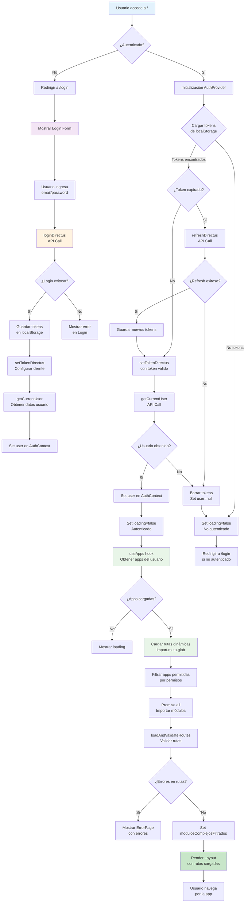

# Flujo de Autenticación y Carga Dinámica de Rutas

## Descripción del Flujo

### 1. Acceso Inicial

- Usuario accede a la aplicación
- AuthProvider verifica estado de autenticación

### 2. Proceso de Login

- Si no autenticado, redirige a `/login`
- Usuario ingresa credenciales
- API call a Directus para autenticación
- Tokens guardados en localStorage
- Usuario obtenido y seteado en contexto

### 3. Inicialización de Sesión

- Al recargar página, verifica tokens existentes
- Si expirados, intenta refresh automático
- Si refresh falla, limpia sesión
- Obtiene datos del usuario actual

### 4. Carga Dinámica de Apps

- Hook `useApps` obtiene lista de apps permitidas para el usuario
- Usa `import.meta.glob` para cargar rutas dinámicamente
- Filtra solo las apps que el usuario tiene permisos
- Importa los módulos de rutas con `Promise.all`

### 5. Validación de Rutas

- `loadAndValidateRoutes` valida estructura de rutas
- Verifica que cada ruta tenga `path`, `element`, etc.
- Si hay errores, muestra página de error con detalles
- Si válidas, setea las rutas filtradas

### 6. Renderizado Final

- Layout principal renderiza con rutas cargadas
- Usuario puede navegar por módulos permitidos
